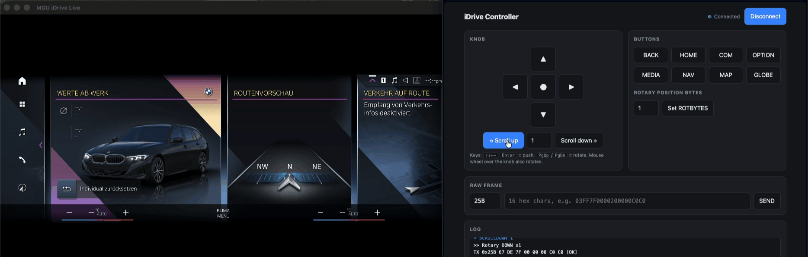

# iDrive Controller Emulator

Arduino sketch and browser GUI that emulate a BMW iDrive controller on CAN. Buttons, knob directions, push and rotary scrolling are sent as `0x25B` frames, so a head unit sees a real controller.

## Hardware

- Arduino with an MCP2515 CAN shield (CS on pin 10, 16 MHz crystal)
- CAN bus at 500 kbps
- Library: [mcp_can](https://github.com/coryjfowler/MCP_CAN_lib)

## Usage

1. Open `iDrive_Controller_Emulator.ino`, install `mcp_can`, and upload.
2. Send commands at 115200 baud, newline-terminated (Serial Monitor or the GUI).

| Command | Action |
|---|---|
| `BACK` `HOME` `COM` `OPTION` `MEDIA` `NAV` `MAP` `GLOBE` | Press a button |
| `UP` `DOWN` `LEFT` `RIGHT` `PUSH` | Knob direction / push |
| `SCROLLDOWN [n]` / `SCROLLUP [n]` | Rotate the knob n steps (default 1, max 100) |
| `ROTBYTES <1-6>` | Low-byte index of the 16-bit rotary position (default 1) |
| `SEND <hexID> <hexData>` | Raw frame, up to 8 bytes, e.g. `SEND 25B 03FF7F0000200000C0C0` |

## GUI

`idrive_gui.html` talks to the board over the Web Serial API.

1. Close the Arduino Serial Monitor (only one program can use the port).
2. Open the file in **Chrome or Edge** (Safari and Firefox are not supported). If the port is blocked on `file://`, run `python3 -m http.server 8000` and open `http://localhost:8000/idrive_gui.html`.
3. Click **Connect Arduino** and pick the port.

Keyboard: arrow keys, Enter = push, PgUp/PgDn = rotate. The mouse wheel over the knob panel also rotates.

## Protocol notes

Frames on `0x25B`: `[counter, FF, 7F, b3, b4, b5, b6, b7]`, idle `00 FF 7F 00 00 00 C0 C0`. The counter increments on every frame.

The rotary position is a 16-bit little-endian value in bytes 1-2 (idle `0x7FFF`). Every frame carries the current position; the receiver computes the delta from the previous one (positive = scroll down, negative = scroll up). This placement was found by experiment.

## Credits

- Button/knob frames: [LeanWasTaken/iDrive](https://github.com/LeanWasTaken/iDrive)
- Rotary delta logic: [llilakoblock/bmw-idrive-touch-esp32-s3](https://github.com/llilakoblock/bmw-idrive-touch-esp32-s3)
